# Top 12 Best Fresh Dog Food Delivery Services in 2025 (Latest Updated)

Your dog deserves better than mystery meat pressed into brown pellets. Fresh dog food delivery has transformed how pet parents feed their furry friends, offering human-grade ingredients delivered straight to your door. Whether you're dealing with a picky eater, managing allergies, or simply want to ditch the processed kibble, these personalized meal services make premium nutrition accessible and convenient.

***

## **[The Farmer's Dog](https://www.thefarmersdog.com)**

The most affordable fresh dog food option that doesn't compromise on quality or nutrition.

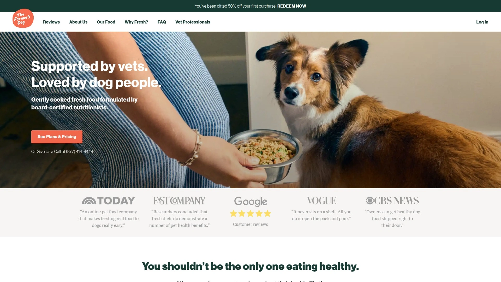

The Farmer's Dog pioneered the fresh food movement back in 2014, making gently cooked, human-grade meals accessible to everyday pet parents. What sets them apart is straightforward pricing that undercuts competitors while maintaining AAFCO and WSAVA compliance. You'll get pre-portioned meals customized to your dog's calorie needs, freshly made and flash-frozen without preservatives.

Their recipes feature real ingredients you can actually see—no mystery meals or synthetic additives. Choose up to three recipes from beef, turkey, chicken, pork, and fish options. The service shines for budget-conscious owners who refuse to sacrifice nutrition. Meals arrive within days of preparation, stored in simple packs that you just open and pour.

Ordering takes minutes through their personalized quiz, and you control delivery frequency completely. The vet-developed formulas work for all life stages, making transitions between puppy and adult food seamless. If you're new to fresh feeding and worried about costs spiraling, this is where you start.

---

## **[JustFoodForDogs](https://www.justfoodfordogs.com)**

Science-backed nutrition with the widest recipe selection and both frozen and shelf-stable options.

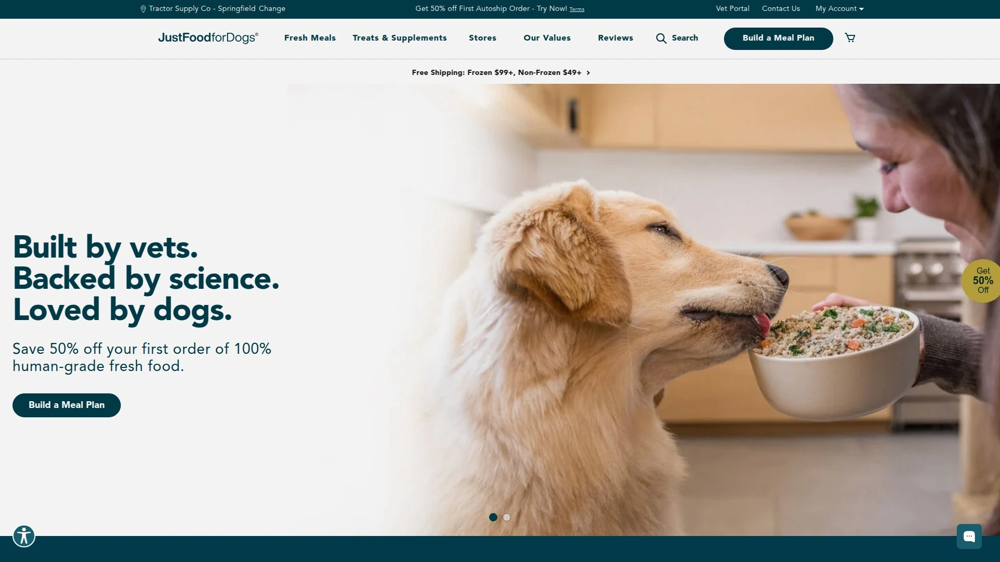

JustFoodForDogs takes fresh feeding seriously with actual veterinary nutritionists on staff and published research backing their formulas. They offer more recipe variety than anyone else, including custom formulations for dogs with specific health conditions. You can order frozen meals shipped nationwide or grab shelf-stable options from retailers like Chewy, Petco, and even select Costco locations.

The brand runs actual feeding trials and employs full-time veterinary nutritionists—not just consultants—making them a standout for WSAVA compliance. Their DIY supplements let you balance homemade meals if you prefer cooking yourself, and their Nutrition Consultants provide free guidance.

Shipping happens in 3-5 business days using dry ice insulation, with separate shipments for frozen and shelf-stable items. Local delivery is available near their kitchen locations with same-day options for orders over $100. The flexibility between frozen delivery and retail pickup makes this ideal for pet parents who want options.

---

## **[Ollie](https://www.myollie.com)**

Perfect for picky eaters with fresh and baked food formats you can mix and match.

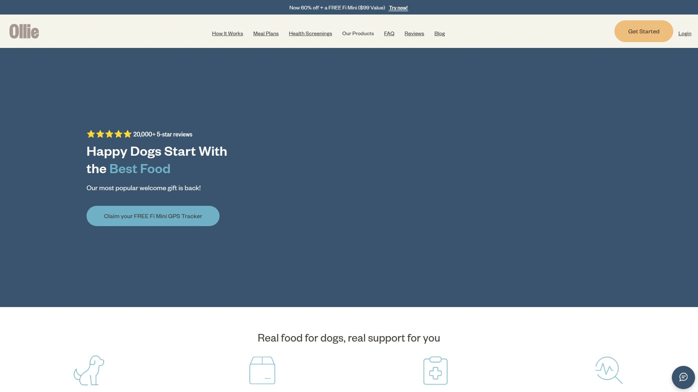

Ollie gives you flexibility that fussy dogs appreciate—choose full fresh, half fresh mixed with your current food, or combine their fresh recipes with baked kibble options. They offer five fresh recipes (beef, chicken, lamb, pork, turkey) plus two baked varieties, and you can select up to four fresh recipes per delivery.

The ordering process is refreshingly simple with a short screening about your dog's activity level and goals. Ollie includes a scooper and storage container with your first order—a small touch that makes daily feeding cleaner. The recipes meet AAFCO standards and are developed with board-certified veterinary nutritionist consultation.

Fresh meals arrive in vacuum-sealed packs that store easily, and the baked option provides convenience when you're traveling or want texture variety. This dual-format approach works beautifully for dogs who get bored with the same texture day after day.

***

## **[PetPlate](https://www.petplate.com)**

Best for dogs with allergies, offering the widest variety of human-grade meals and textures.

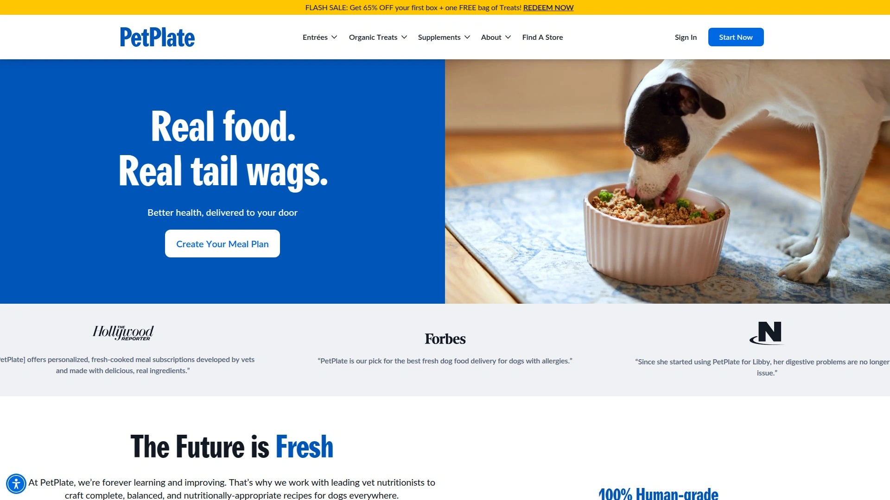

PetPlate specializes in dogs with sensitive stomachs and food allergies, providing both fresh cooked and baked dry options. They offer more texture variety than competitors—pick wet, dry, or both—with protein options tailored around common allergens. The meals are slow-cooked at low temperatures to preserve nutrient bioavailability.

Every recipe is perfectly portioned based on your dog's unique profile, taking the guesswork out of feeding. They also offer a Topper Plan that's 25% of a full plan, perfect for gradually introducing fresh food or supplementing current meals. The 100% money-back guarantee on first orders removes the risk of trying.

PetPlate prepares meals in human-grade kitchens following USDA guidelines, hot-filling for safety and flash-freezing to lock freshness. Their meals arrive in resealable containers that eliminate the mess of half-open pouches in your fridge.

***

## **[Nom Nom](https://www.nomnomnow.com)**

Easy-to-serve preportioned meals with visible fresh ingredients and different recipe pricing tiers.

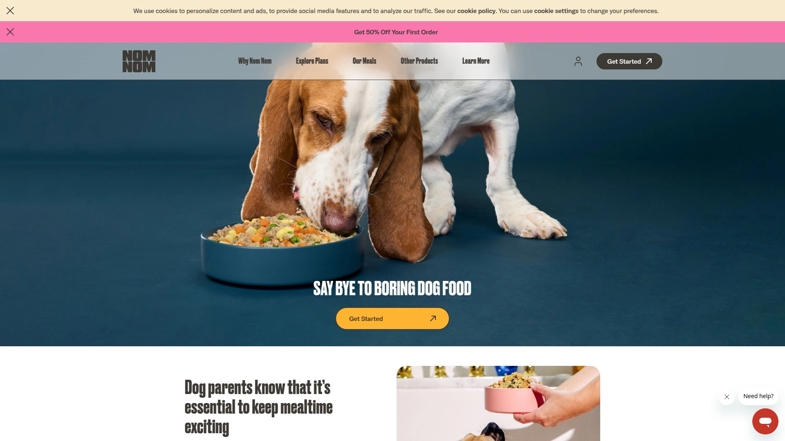

Nom Nom ships individual preportioned packs that make feeding absolutely effortless—no measuring, no guessing. The fresh, whole ingredients are clearly visible in each pack, with recognizable chunks of meat and vegetables that reassure you about quality. They offer six recipes including beef mash, chicken cuisine, pork potluck, and unique options like turkey and chicken cookout.

The pricing structure is smart—chicken is most affordable, pork and turkey sit mid-range, and beef mash is premium, letting you balance budget with variety. You can select up to two recipes per delivery, and the website is genuinely easy to navigate. The brand also offers vet-developed probiotics and GI supplements you can add to support digestive health.

Meals ship within 1-2 business days in insulated boxes with ice packs, and you can pause or adjust delivery dates easily through your account. They're also available at Chewy and Petsmart for added convenience.

***

## **[We Feed Raw](https://wefeedraw.com)**

High-pressure processed raw food that preserves nutrients while eliminating harmful bacteria.

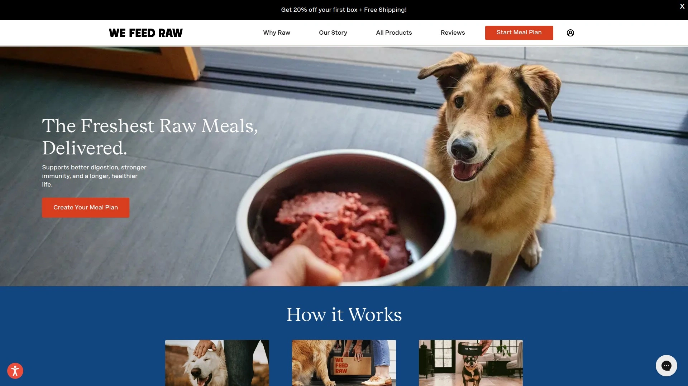

We Feed Raw offers true raw feeding made safe through high-pressure processing (HPP) instead of heat, killing pathogens while maintaining the nutritional benefits of raw meat. They provide six single-protein frozen options—chicken, duck, beef, venison, lamb, and turkey—plus freeze-dried varieties. The pasture-raised lamb and venison come from New Zealand, with all other meats sourced in the United States.

Raw feeding can improve your dog's coat, digestion, energy levels, and dental health. Each recipe contains finely ground meat, organ meat, and bones for calcium and roughage, plus a nutrient premix with flaxseed, vitamins, and minerals. The freeze-dried options contain 85% meat and organ with 15% phytonutrients from fruits and vegetables.

You can choose recurring subscriptions or one-time bulk orders with no obligations. They also offer 50% raw feeding plans to make the investment more manageable for large dogs. Preparation happens in USDA-certified facilities with strict BRC compliance.

---

## **[Spot & Tango](https://spotandtango.com)**

UnKibble dried food and fresh frozen meals with customizable plans and veterinary nutritionist formulation.

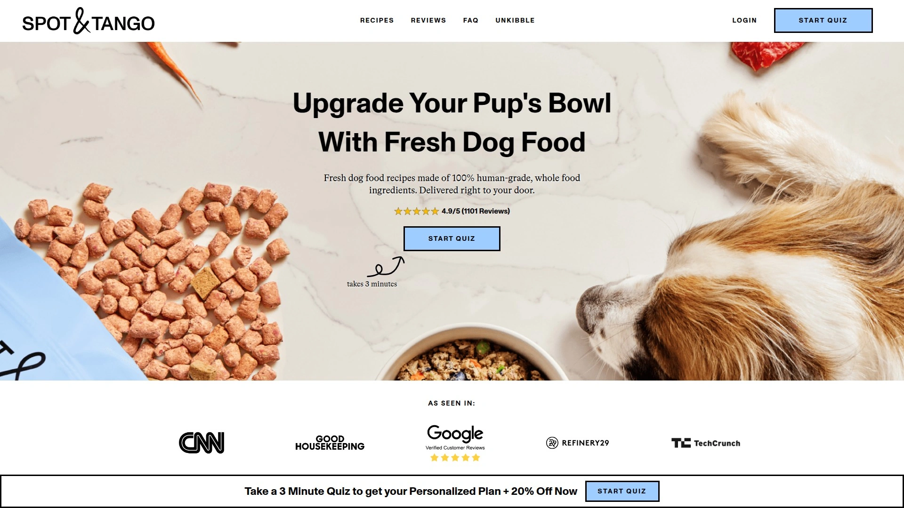

Spot & Tango gives you two distinct paths: UnKibble (gently dried with their Fresh Dry™ process) or Fresh frozen meals, both made with 100% human-grade, non-GMO ingredients. The UnKibble offers kibble convenience with healthier ingredients across four recipes, while Fresh provides lightly cooked, flash-frozen meals in three varieties. All recipes meet AAFCO standards for puppies and adults.

The 14-day trial makes testing risk-free, and you can choose full portions or toppers to gradually introduce fresh food on a budget. Each UnKibble bag includes a custom scoop for easy portioning, and Fresh meals are pre-portioned requiring only thawing. They also offer six snack flavors and four supplement types (Calming, Hip & Joint, Allergy & Immune, Probiotic).

All ingredients are fresh and locally sourced, cooked in small batches in a USDA facility. The minimal-ingredient philosophy means simpler recipes without unnecessary fillers or preservatives.

***

## **[Maev](https://meetmaev.com)**

Frozen raw food that requires no thawing, delivered bite-sized and ready to serve immediately.

Maev revolutionizes raw feeding with bite-sized frozen pieces you serve straight from the freezer—no prep, no thawing, no mess. The frozen texture helps remove plaque buildup naturally while delivering superior nutrient absorption compared to cooked foods. They offer beef, chicken, and puppy formulas, all PhD-Vet formulated and AAFCO-approved.

The raw food is higher in protein than fresh cooked options and contains zero additives, fillers, or synthetics. Freezing at approximately -14°F creates smaller ice crystals that prevent moisture loss and protect ingredient cell membranes. Most dog parents notice improvements in coat, energy, digestion, and breath within 28 days.

Each recipe contains just 11 straightforward ingredients including USDA lean proteins, whole fruits and vegetables, and scientifically studied supplements like chondroitin and glucosamine. The food arrives frozen with dry ice in eco-friendly packaging. Variety packs target specific health goals like weight management, hip and joint health, or anxiety and calming.

***

## **[Sundays for Dogs](https://sundaysfordogs.com)**

Air-dried dog food with 90% meat content, veterinarian-founded, and shelf-stable convenience.

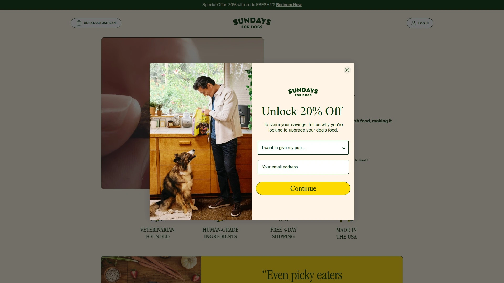

Sundays for Dogs was founded by veterinarians who created air-dried food that combines fresh food nutrition with kibble convenience. The gentle air-drying process kills germs while locking in nutrients, and the shelf-stable format means no refrigeration needed. With 90% meat content and zero synthetic additives, it's designed for even the pickiest eaters.

The human-grade ingredients are air-dried at low temperatures to preserve nutritional integrity. You get automatic 20% discounts on recurring orders, and there's zero commitment—cancel, pause, or modify anytime without fees. The customizable meal plans time deliveries perfectly so you never run out or have excess.

The air-dried format makes this ideal for pet parents who want fresh food benefits but need the convenience of shelf-stable storage. It's also budget-friendly compared to frozen fresh options while maintaining human-grade quality.

***

## **[Raised Right](https://www.raisedrightpets.com)**

Gently cooked human-grade food with free shipping to 48 states and compostable packaging.

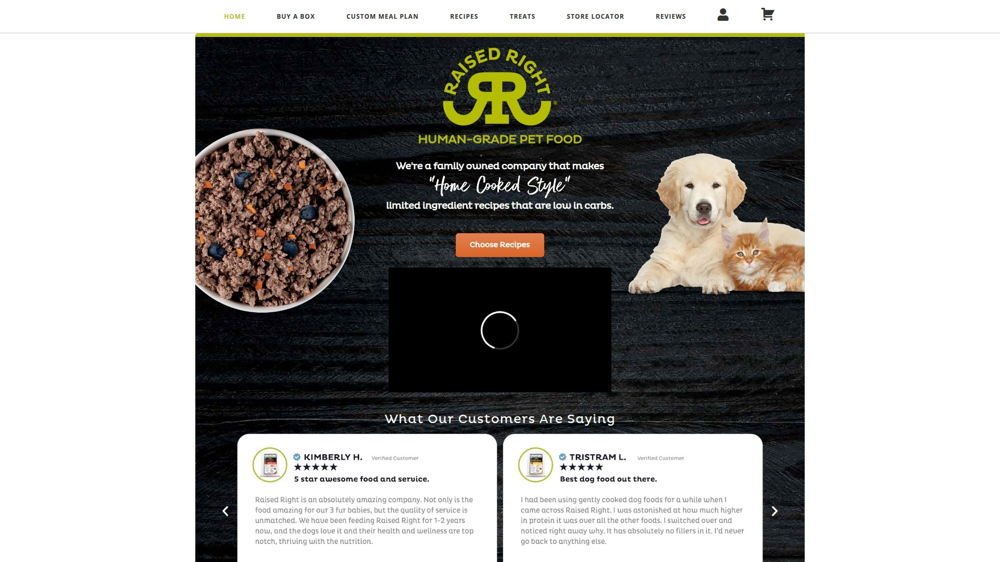

Raised Right brings farming and ranching family values to pet food, offering the same quality they'd raise for humans. Their gently cooked meals use human-grade meats and vegetables, prepared in small batches to retain nutritional value. Free shipping covers all 48 contiguous states, with Alaska and Hawaii available for a fee.

The proprietary algorithm calculates exact calorie needs based on age, weight, activity level, and weight goals for dogs over one year old. Each bag includes a best-before date, and defrosted food stays fresh in the refrigerator for six days. Orders placed before Monday 9pm EST arrive by Saturday at the latest, with some locations receiving delivery as early as Monday.

The packaging is environmentally conscious—cardboard boxes for curbside recycling and refrigerated liners made from non-GMO corn that meet compostability standards. They provide detailed 10-day transition instructions to help dogs adjust gradually.

---

## **[Open Farm](https://openfarmpet.com)**

Ethically sourced gently cooked fresh food plus premium kibble options with transparent ingredient tracing.

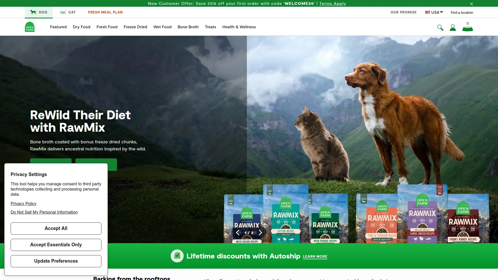

Open Farm obsesses over ethical sourcing, offering gently cooked fresh meals alongside high-quality dry food options. Their slow-cooked fresh recipes use humanely-raised proteins, and every ingredient can be traced back to its source. You can choose grain-free or wholesome grain varieties depending on your dog's needs.

The autoship subscription provides 20% off your first order, 5% savings on all future orders, plus surprise gifts and annual nutritional consults. Free shipping applies to orders over $50, and you get first access to in-demand products. Their customer service provides fast shipping—orders often arrive within two days of placement.

Fresh meals come in varieties like Homestead Turkey & Ancient Grains and Catch of the Season Whitefish. You can also add bone broths, treats, and supplements to boost nutrition and flavor. The combination of fresh and dry options gives flexibility for different feeding situations.

***

## **[Kabo](https://kabo.co)**

Canadian fresh dog food delivery with human-grade ingredients and vet-approved recipes.

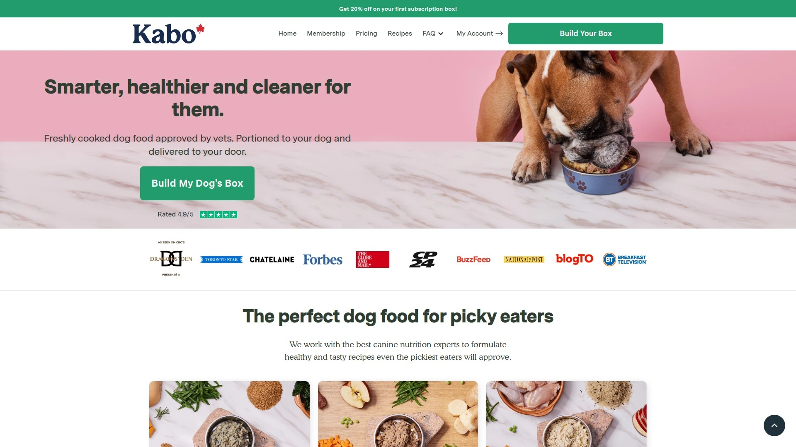

Kabo is Canada's premier fresh dog food service, founded by twin brothers inspired by their beloved Chow Chow. They offer gently cooked fresh meals plus kibble options, all made in Canada with human-grade ingredients. The fresh cooked recipes are prepared the same way you'd make food at home, retaining maximum nutritional value.

Every meal lists protein as the first ingredient, supplemented with healthy carbs, fiber, fruits, and vegetables. Free delivery ships straight to your door across Canada, eliminating last-minute pet store runs. The company was founded in 2019 after the brothers realized conventional processed food might have contributed to their dog's stomach cancer.

The mission focuses on helping pet parents create healthy routines with quality, nutritious meals. Recipes are formulated by nutritionists and vet-approved, making them suitable for dogs at various life stages.

***

## FAQ

**How do I transition my dog to fresh food without upsetting their stomach?**

Start slowly by mixing 10% fresh food with 90% current food for the first two days, then gradually increase the fresh food ratio by 10% every two days over 10 days. This allows your dog's digestive system to adjust to the richer nutrient profile. Watch for loose stools and slow down the transition if needed.

**Will fresh dog food really make a visible difference in my dog's health?**

Most pet parents report noticeable improvements within 2-4 weeks, including shinier coat, more consistent energy levels, better breath, and healthier bowel movements. Fresh food offers higher bioavailability of nutrients compared to heavily processed kibble, meaning your dog absorbs more of what they eat.

**How do I know fresh dog food is actually safer than kibble?**

Look for brands that meet AAFCO nutritional standards and follow WSAVA guidelines with board-certified veterinary nutritionists on staff. Fresh food prepared in human-grade kitchens follows USDA safety protocols rather than looser pet food manufacturing standards. Check that companies use high-pressure processing or proper cooking methods to eliminate harmful bacteria.

***

## Conclusion

Switching to fresh dog food doesn't have to drain your wallet or complicate your routine. These services prove that human-grade nutrition can be affordable, convenient, and tailored to your dog's unique needs. [The Farmer's Dog](https://www.thefarmersdog.com) leads the pack for budget-conscious pet parents who want veterinary-developed meals without premium pricing—making fresh feeding accessible to dogs everywhere. Your pup eats every single day, so why not make those meals count?
